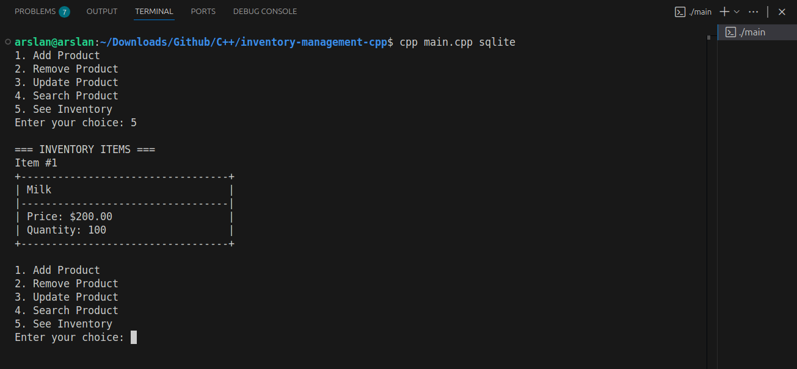

# C++ Inventory Management System


This was a group project completed with a fellow student as part of coursework. I was primarily responsible for the overall implementation, including planning, coding, and testing.

---

## Project Overview

This Inventory Management System is a console-based application written in C++ with persistant SQLite storage and `modern_sqlite_cpp` library file.  
It allows users to manage product records including:

- Searching by product name - to view all its details
- Adding new items  
- Removing entries  
- Updating product details  
- Viewing the complete inventory  

Each product consists of:

- Name
- Price
- Quantity

---

```text
1. Start
2. Load the default inventory from the database
3. Display menu options:
   - If no items exist, show only the "Add" option
4. Take user input for the desired action
5. Execute chosen action via DAO/CLI:
   - Search, Add, Remove, Update, View, or Exit
6. Repeat steps 3–5 until the user chooses to exit (default option `0`)
```

---

## Flowchart


## How to Compile and Run

### Tools Used

- g++ - C++ Compiler
- SQLite (for persistant Storage)
- VSCode - IDE

The following things are also installed (for Ubuntu)

```bash
sudo apt install libsqlite3-dev sqlite3
```

But its too verbose, hence an easy solution, i found was `sqlite_modern_cpp`, its syntax is quite easy and clear.

```bash
sudo apt install libspdlog-dev

```

``` bash

git clone [https://github.com/ch-arslanahmad/inventory-management-cpp/](https://github.com/ch-arslanahmad/inventory-management-cpp/)
cd inventory-management-cpp
g++ main.cpp -o main -lsqlite3  
```

To run the executable:
Code snippet

```cmd
main.exe # if on Windows
./main # if on Linux/macOS

```

## Output Example



## File Structure

```text
├── .
├── main.cpp            # ---- Main File
├── databaseDAO.h       # DAO for DB operations
├── display.h           
├── input.h             # Handles all input
├── images/
│   ├── ..
│   └── ... 
├── Product.h           # Model Class for inventory item
└── storage/            # folder for storage stuff
    ├── inventory.db    # -- database file
    └── lib/            # SQLite library
        └── sqlite_modern_cpp.h 

```

## Applications

This system has both real-world and educational use cases:

- Managing stock for small businesses or home-based shops
- Teaching fundamental C++ programming concepts
- Prototyping a point-of-sale or inventory software
- Organizing personal collections (e.g., books, tools)

## Notes

This project was developed for the **Programming Fundamentals course** in Semester 2. It demonstrates foundational concepts in C++ such as:

- Loops and conditionals
- Functions and user-defined structures
- Vector manipulation
- Console I/O handling

### Updates (Self)

- Refactor Code & Added persistent SQLite storage via `sqlite_modern_cpp`
- Implemented menu-based CRUD operations of the database

## License

This project is released under the MIT License, making it free for anyone to use.
