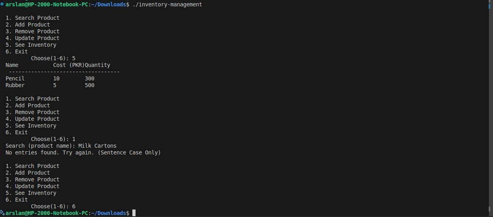

# Inventory Management System (C++)


This was a group project completed with a fellow student as part of coursework. I was primarily responsible for the overall implementation, including planning, coding, and testing.

---

## Project Overview

This Inventory Management System is a console-based application written in C++ with persistant SQLite storage and `modern_sqlite_cpp` library file.  
It allows users to manage product records including:

- Searching by product name - to view all its details
- Adding new items  
- Removing entries  
- Updating product details  
- Viewing the complete inventory  

Each product consists of:

- Name
- Price
- Quantity

---

## Algorithm Summary

```text
1. Start
2. Load default inventory
3. Display menu options
4. Take user input of the choice
5. Execute the choice:
   - Search / Add / Remove / Update / View / Exit
6. Loop until user exits
```

---

## Flowchart


---

## How to Compile and Run

```terminal

git clone https://github.com/ch-arslanahmad/inventory-management-cpp/
cd inventory-management-cpp
g++ main.cpp -o main  

```

Then to run,

```terminal
main.exe # if windows
./main # if Linux/macOS
```

## Output Example



---

## File Structure

```text
 Inventory-Management
├── inventory-management.cpp            # Source code
├── README.md           # This file
└── storage/    # DB file, DB library (header) files (sqlite_modern_cpp)
    └── lib/
└── images/
    └── inventory-flowchart.png   # Flowchart
    └── output_inventory-management.png # Output Image
```

---

## Applications

This system has real-world and educational use cases:

- Managing stock for small businesses or home-based shops  
- Teaching basic programming concepts in C++  
- Prototyping point-of-sale or inventory software  
- Organizing personal collections (books, tools, etc.)

---

## Notes

This project was developed as part of the **Programming Fundamentals** course in Semester 2.  
It demonstrates foundational concepts in C++ such as:

- Loops and conditionals  
- Functions and user-defined structures  
- Vector manipulation  
- Console I/O handling  

### Update (Self-Driven):
Added Persistant SQLite Storage via `sqlite_modern_cpp`

---


## License

This project has `MIT license` hence anyone can use it.

---
