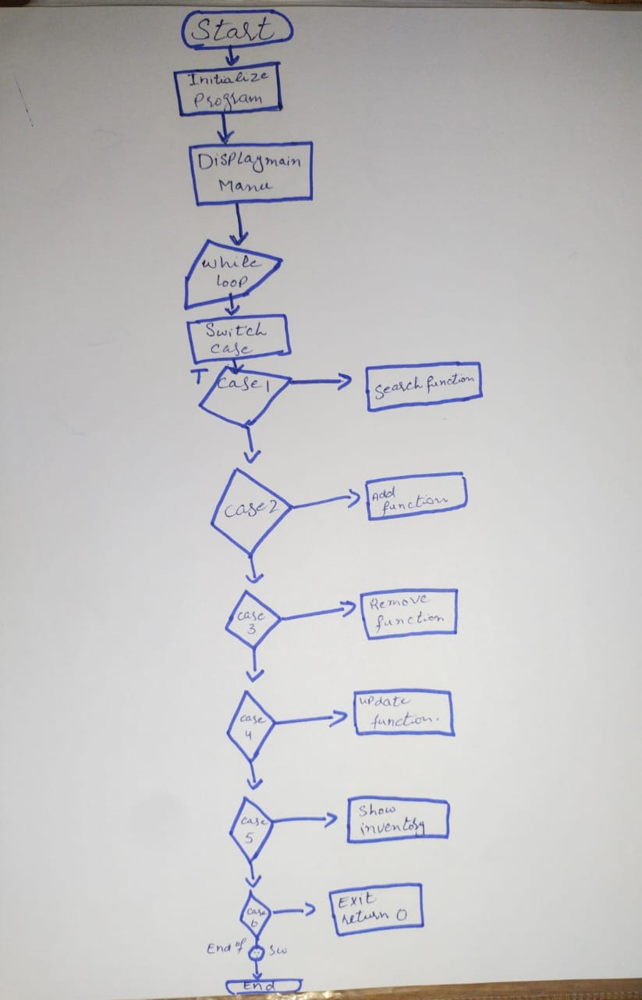

# 🧾 Inventory Management System (C++)


<div align = "center">

</div>


> 🎓 **Semester#2 Project – Programming Fundamentals**  
> 🧑‍🤝‍🧑 **Group 11:**  
> - M. Arslan (70177073, Sem#2, Section-I)  
> - M. Faseeh (7017604, Sem#2, Section-I)  
> 👨‍🏫 Submitted to: Muhammad Aqeel Anwar  
> 📍 Department of Technology, University of Lahore  

---

## 📌 Project Overview

This Inventory Management System is a console-based application written in C++.  
It allows users to manage product records including:

- 🔍 Searching by product name  
- ➕ Adding new items  
- 🗑️ Removing entries  
- ✏️ Updating product details  
- 📋 Viewing the complete inventory  

Each product consists of:
- Name
- Price
- Quantity

---

## 🧠 Algorithm Summary

```text
1. Start
2. Load default inventory
3. Display menu options
4. Take user input of the choice
5. Execute the choice:
   - Search / Add / Remove / Update / View / Exit
6. Loop until user exits
```

---

## 📈 Flowchart




---

## ⚙️ How to Compile and Run
As it is a one file line code, you could use Online Compilers, e.g, [Programiz C++ Compiler.](https://www.programiz.com/cpp-programming/online-compiler/)

## 📤 Output Example


---

## 📁 File Structure

```text
📁 Inventory-Management
├── main.cpp            # Source code
├── README.md           # This file
└── images/
    └── inventory-flowchart.png   # Flowchart
    └── uol-modified.png
```

---

## 📦 Applications

This system has real-world and educational use cases:

- 🛒 Managing stock for small businesses or home-based shops  
- 👨‍🏫 Teaching basic programming concepts in C++  
- 🧪 Prototyping point-of-sale or inventory software  
- 📚 Organizing personal collections (books, tools, etc.)

---

## 📝 Notes

This project was developed as part of the **Programming Fundamentals** course in Semester 2.  
It demonstrates foundational concepts in C++ such as:

- Loops and conditionals  
- Functions and user-defined structures  
- Vector manipulation  
- Console I/O handling  


---

## 🤝 Contribution

This is a student project and is not open for external contributions.

---

## 📃 License

This project is intended for educational use only and does not carry a license.

---
